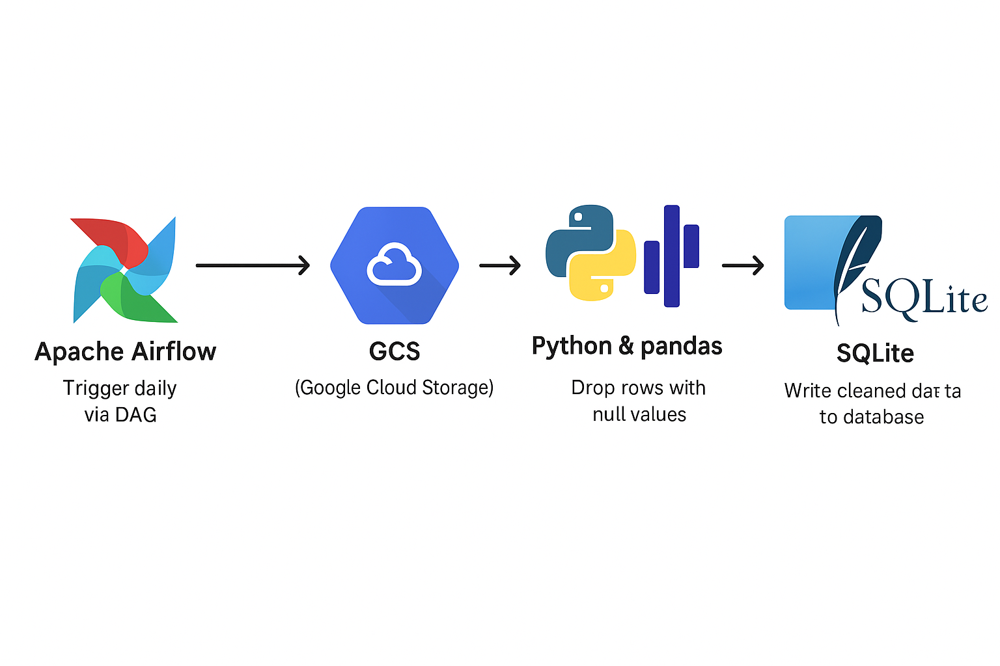

# Beginner ETL Pipeline using Cloud Composer (Apache Airflow) on GCP 🌥️📊

This is a **beginner-friendly ETL pipeline project** built using **Cloud Composer (Apache Airflow)** on **Google Cloud Platform**. It showcases how to automate a basic CSV data cleaning task and store the final results in both CSV and SQLite formats.

---

## 📁 Repository Structure

```
.
├── User_details.csv                        # Raw input CSV file
├── architecture.png                        # Architecture diagram of the pipeline
├── dag.py                                  # Airflow DAG file
├── data_Cleaned_user_details.csv           # Output cleaned CSV file (auto-generated)
├── data_Cleaned_user_details_sqlite.db     # Output SQLite DB file (auto-generated)
├── extract_transform_load.py               # ETL script run by the DAG
```

---

## 📦 Composer Bucket Structure (Google Cloud Storage)

```
gs://your-composer-bucket/
├── data/
│   └── User_details.csv
├── dags/
│   ├── dag.py
│   └── scripts/
│       └── extract_transform_load.py
```

---

## 🛠️ Project Workflow

1. **Composer Environment**: Created on GCP using Cloud Composer.
2. **Upload Files**:
   - `User_details.csv` ➝ Upload to `/data/` folder inside the Composer bucket.
   - `dag.py` ➝ Upload to `/dags/` folder.
   - `extract_transform_load.py` ➝ Upload to `/dags/scripts/` folder.
3. **DAG Execution**:
   - When the DAG runs, it triggers the `extract_transform_load.py` script via `BashOperator`.
   - This script performs:
     - **Extraction** of data from `User_details.csv`.
     - **Transformation** by dropping rows with null values.
     - **Loading** into:
       - A cleaned CSV file `data_Cleaned_user_details.csv`
       - A SQLite database `data_Cleaned_user_details_sqlite.db`

---

## 🔍 Code Highlights

### `dag.py` – Airflow DAG Definition
```python
from airflow import DAG
from airflow.operators.bash_operator import BashOperator
from datetime import datetime

default_args = {
    'owner': 'airflow',
    'start_date': datetime(2024, 4, 18)
}

with DAG(
    'csv_etl',
    default_args=default_args,
    schedule_interval='@daily',
    catchup=False,
) as dag:
    run_etl = BashOperator(
        task_id='run_etl_script',
        bash_command='python /home/airflow/gcs/dags/scripts/extract_transform_load.py',
    )
```

### `extract_transform_load.py` – ETL Script
```python
import pandas as pd
import sqlite3

input_file = "/home/airflow/gcs/data/User_details.csv"
output_file = "/home/airflow/gcs/data/Cleaned_user_details.csv"
sqlite_db = "/home/airflow/gcs/data/Cleaned_user_details_sqlite.db"

df = pd.read_csv(input_file)
df = df.dropna()
df.to_csv(output_file, index=False)

conn = sqlite3.connect(sqlite_db)
df.to_sql('cleaned_data', conn, if_exists='replace', index=False)
conn.close()

print("ETL complete: data loaded to SQLite.")
```

---

## 🧱 Architecture Overview



> The above diagram visualizes the GCP services involved and the step-by-step flow of the data.

---

## 💡 What You’ll Learn

- Basics of Cloud Composer (Apache Airflow)
- Automating ETL with Python
- Using BashOperator in Airflow
- Data cleaning with pandas
- Exporting cleaned data to SQLite and CSV
- Structuring a GCP-based data project

---

## 🚀 Getting Started

1. Set up a Composer environment on GCP.
2. Clone this repo:
   ```bash
   git clone https://github.com/your-username/beginner-etl-pipeline-gcp.git
   cd beginner-etl-pipeline-gcp
   ```
3. Upload files as per bucket structure.
4. Enable your DAG from Airflow UI and trigger it.
5. Check the `/data/` folder for cleaned output files!

---

## 🧠 Perfect For

- GCP beginners
- New to Airflow & ETL
- Anyone who wants to learn cloud automation with simple examples

---

## ✨ Star this repo if you found it helpful! Happy Learning 🚀
